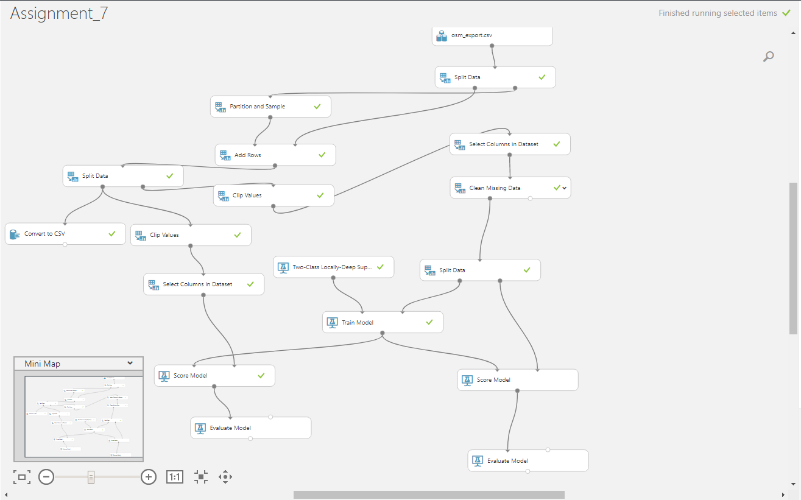
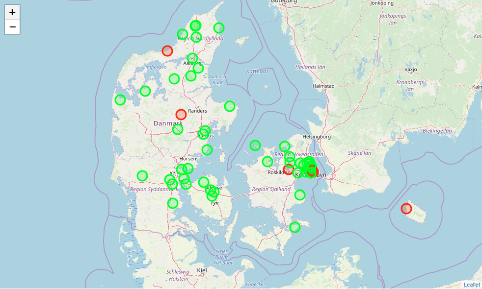
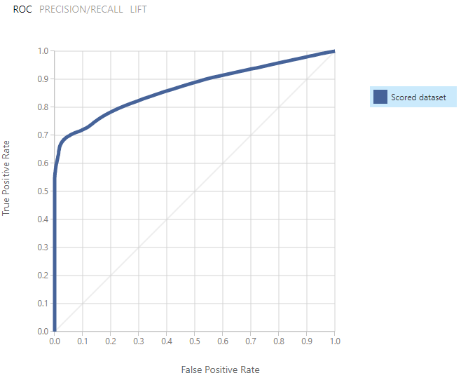
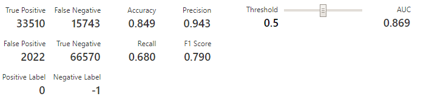

# Assignment 7 - Basic ML - Class Prediction

Gruppe Dangerous Memory: Christian, Alexander

https://github.com/datsoftlyngby/soft2019fall-bi-teaching-material/tree/master/week41/assignment_7

## Supervised Machine Learning; classification.

For this assignment, we used [Azure Machine Learning Studio](https://studio.azureml.net/Home/ViewWorkspaceCached/7eca94046b164244a6a0d7f862227a6a#Workspaces/Experiments/Experiment/7eca94046b164244a6a0d7f862227a6a.f-id.edd8eef847184b4dbaec3c7b5688993a/ViewExperiment), AML, to Process the Boliga data, train a machine learning model and validate it:



We start by uploading the csv file with boliga data & lat lon added already. 

we split the data on rows containing a price change in percentage of 0. Then, for the data containing price change in percentage, we change all negative values to -1, and all positive to +1. (We also extract a small sample of the data for later validation, and save it as a csv file) 

Since a large majority of the data is where price change in percentage is 0, we choose to only use 25% of this data for the further modelling, as we aim to find out if weighting the "real" changes could allow our model to predict better..

We then use the data to train a Support Vector Machine Model, score and evaluate it. Also we run the aformentioned small sample of the data through the trained model.

We end up with 2 .csv files from the machine learning exercise, each containing  the same ~ 60 rows worth of data, but "Assignment_7_50 points.csv" contains the original price change in percantage values (ie -51), and "Assignment_7_score model.csv" contains the modified price change in percantage values (ie -1).

We then import both csv files using panda, and plot each housing records lat/lon on a folium map.

We colorcode each map marker to visually indicate when the models prediction of price change corresponds with the real situation (green) and when it predicted wrong (red).

**Folium plot**


```python
import folium
import pandas as pd

m = folium.Map([56,11], zoom_start=7)


model_62_points = pd.read_csv('Assignment_7_50 points.csv')
model_62_score = pd.read_csv('Assignment_7_score model.csv')

# resetting index
model_62_points = model_62_points.dropna()
model_62_score = model_62_score.dropna()
model_62_points = model_62_points.reset_index(drop=True)
model_62_score = model_62_score.reset_index(drop=True)

for index, row in model_62_points.iterrows():

    if(row['price_change_in_pct'] <= -1 & int(model_62_score.iloc[index]['Scored Labels']) == -1) :
        folium.CircleMarker(location=[row['lat'], row['lon']], popup="ACTUAL: "+str(row['price_change_in_pct'])+"<br>"+"PREDICTED: "+model_62_score.iloc[index]['Scored Labels'].astype(str), color='#00ff00', fill_color="#00ff00").add_to(m)

    elif(row['price_change_in_pct'] == int(model_62_score.iloc[index]['Scored Labels'])) :
        folium.CircleMarker(location=[row['lat'], row['lon']], popup="ACTUAL: "+str(row['price_change_in_pct'])+"<br>"+"PREDICTED: "+model_62_score.iloc[index]['Scored Labels'].astype(str), color='#00ff00', fill_color="#00ff00").add_to(m)
    
    elif(row['price_change_in_pct'] >= 1 & int(model_62_score.iloc[index]['Scored Labels']) == 1):
        folium.CircleMarker(location=[row['lat'], row['lon']], popup="ACTUAL: "+str(row['price_change_in_pct'])+"<br>"+"PREDICTED: "+model_62_score.iloc[index]['Scored Labels'].astype(str), color='#00ff00', fill_color="#00ff00").add_to(m)
    
    else: 
        folium.CircleMarker(location=[row['lat'], row['lon']], popup="ACTUAL: "+str(row['price_change_in_pct'])+"<br>"+"PREDICTED: "+model_62_score.iloc[index]['Scored Labels'].astype(str), color='#ff0000', fill_color="#ff0000").add_to(m)
m
```





**Findings and evaluation**

The trained and evaluated models [ROC curve](https://en.wikipedia.org/wiki/Receiver_operating_characteristic) is as follows:




And the details related is as follows:



From this, and the small sample plot above, it seems that our initial attempt to train a model to be able to predict was somewhat succesful. The models ROC curve anbd the model details show that somewhat accurate as predicting of a row of housing data will sell at a changed price. The model could be "massaged" more to maybe bring down the number of "false negatives" more, maybe by further reduce the impact of "0" percentage change data..
